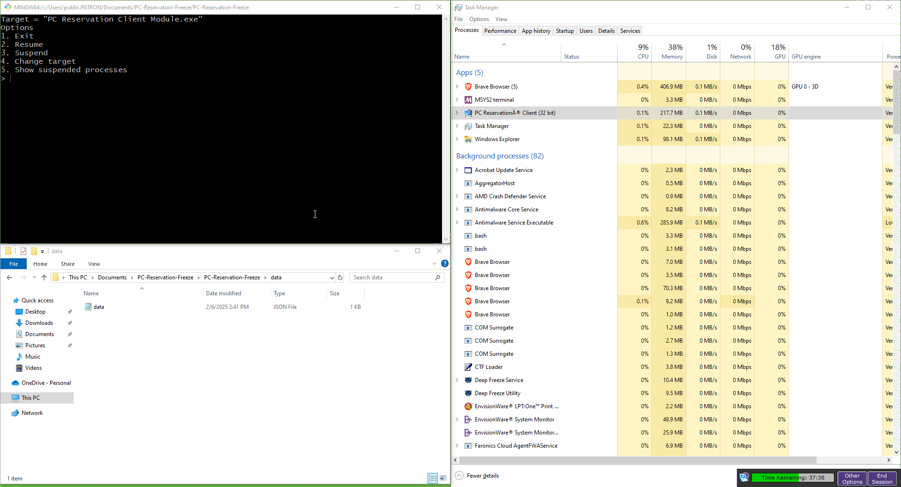

# ATX Library Time-limit bypass and suspension utliity tool
*You can suspend most programs with this utility!*

## Description
This is a tool that suspends a programs *`threads`* which will effectively freeze the program. 

## Table of Contents
- [Installation](#installation)
- [Usage](#usage)
- [Showcase](#showcase)
- [Contributing](#contributing)
- [License](#license)

## Installation
1. Clone the repository:
   ```bash
   git clone https://github.com/Human505-oatmeal/PC-Reservation-Freeze.git
   ```
2. Navigate to the project folder:
   ```bash
   cd PC-Reservation-Freeze
   ```
3. Install the required dependencies:
  ```bash
  pip3 install -r requirements.txt
```
4. Run the application:
  ```bash
  python main.py
```

## Usage
*The questionnaire will tell you everything you need to do, I made it idiot-proof!*

## Showcase


## Features
- As we mentioned in the *description* it will pause all of a programs threads *fantastic for bypassing time-limit programs!*
- Stores all processes that are suspended into `data.json`
- Shows all suspended processes
- Allows the user to dynamically change the target to *ANY* program you want!

## Contributing
1. Fork the repository
2. Create a new branch *(`git checkout -b new-feature-branch`)*
3. Make your changes
4. Commit your changes *(`git commit -m "added a super cool feature`)*
5. Push to the branch *(`git push origin new-feature-branch`)*
6. Create a PR ***pull request for the n00bs***

## License
This project is licensed under the MIT License - See 

## Acknowledgements
- [Process Explorer](https://learn.microsoft.com/en-us/sysinternals/downloads/process-explorer) - *I wouldn't get the idea otherwise tbh*
